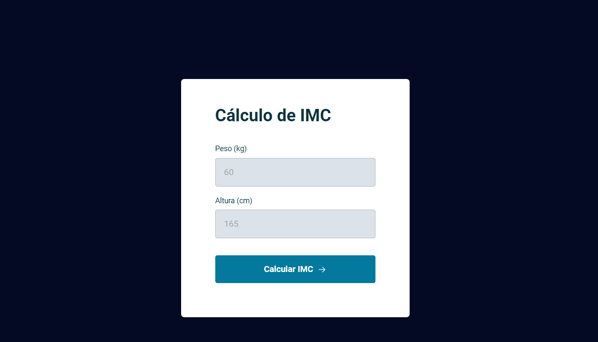

<h1 align="center">Calculadora de IMC</h1>

  <a href="#-tecnologias">Tecnologias</a>&nbsp;&nbsp;&nbsp;|&nbsp;&nbsp;&nbsp;
  <a href="#-projeto">Projeto</a>&nbsp;&nbsp;&nbsp;|&nbsp;&nbsp;&nbsp;

 

Você pode visualizar projeto completo através [DESSE LINK](https://sarahvjustino.github.io/calculadora-IMC-Explorer/)

## 🚀 Tecnologias

Esse projeto foi desenvolvido com as seguintes tecnologias:

- HTML e CSS
- JavaScript
- Git e Github

## 💻 Projeto

Projeto de uma calculadora de IMC que extrai os dados digitados nos campos pelo usúario e exibi o resultado em um modal.
